# Amazon_Vine_Analysis, Module 16 Challenge

## Deliverable 1: Perform ETL on Amazon Product Reviews 

The Amazon Review: **"Musical Instruments"** dataset was selected, and is extracted as a DataFrame.

The extracted dataset is transformed into four DataFrames with the correct columns.

* Customer ID and Count

* Product ID and Title

* Review ID

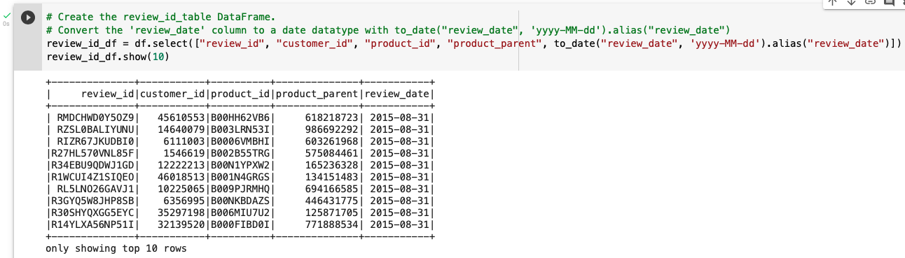

* Vine Table

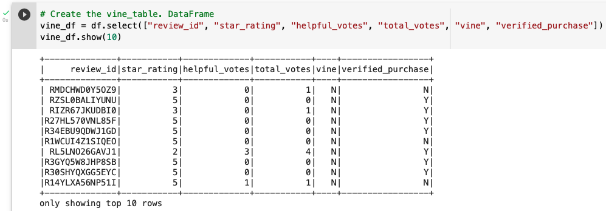

Four DataFrames.

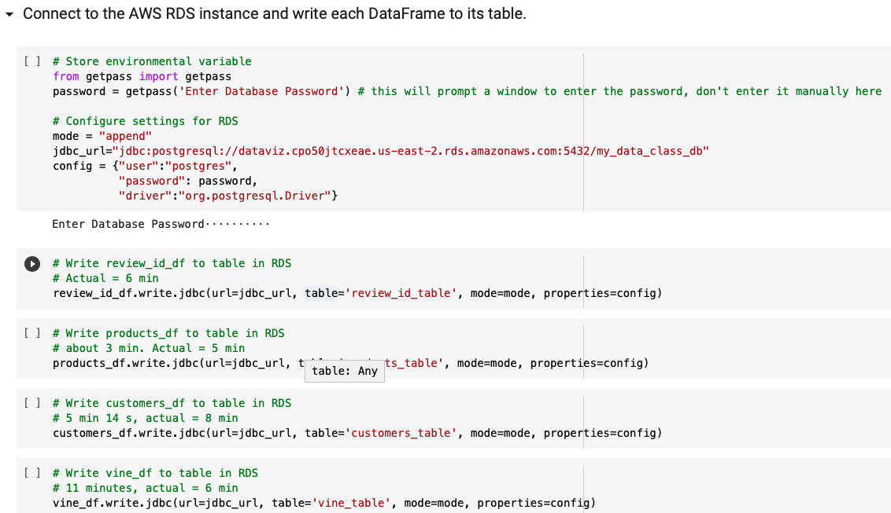

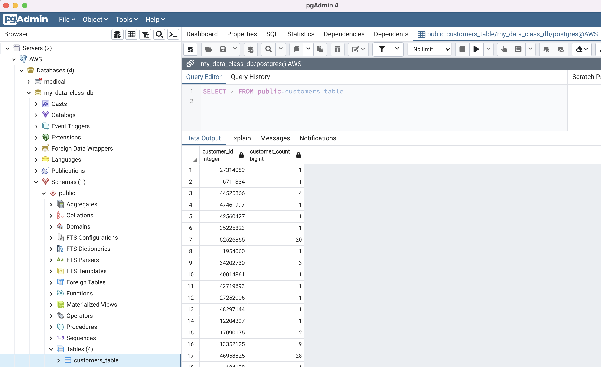

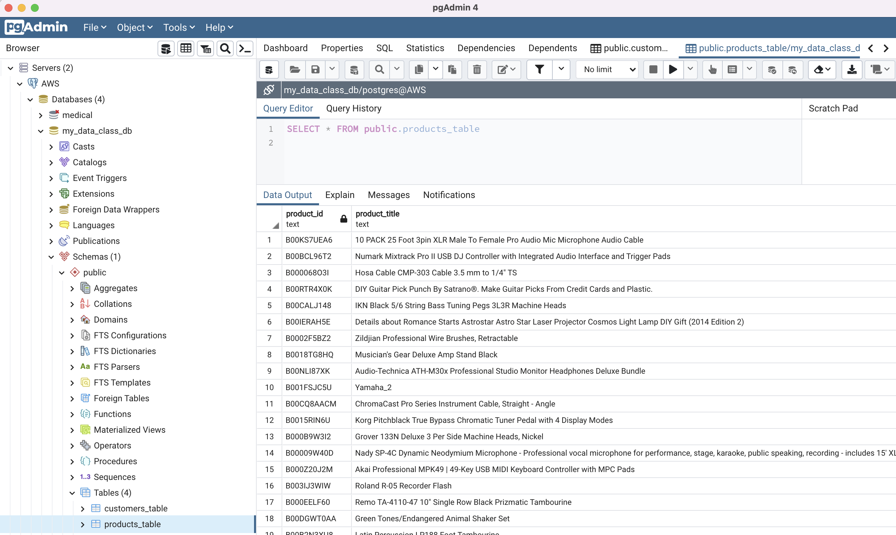

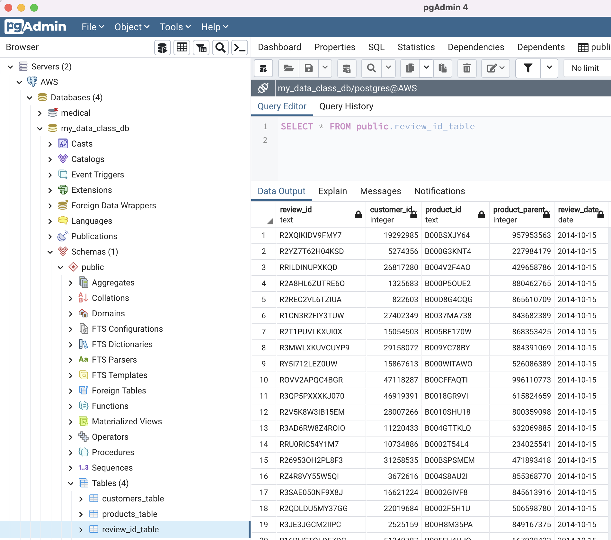

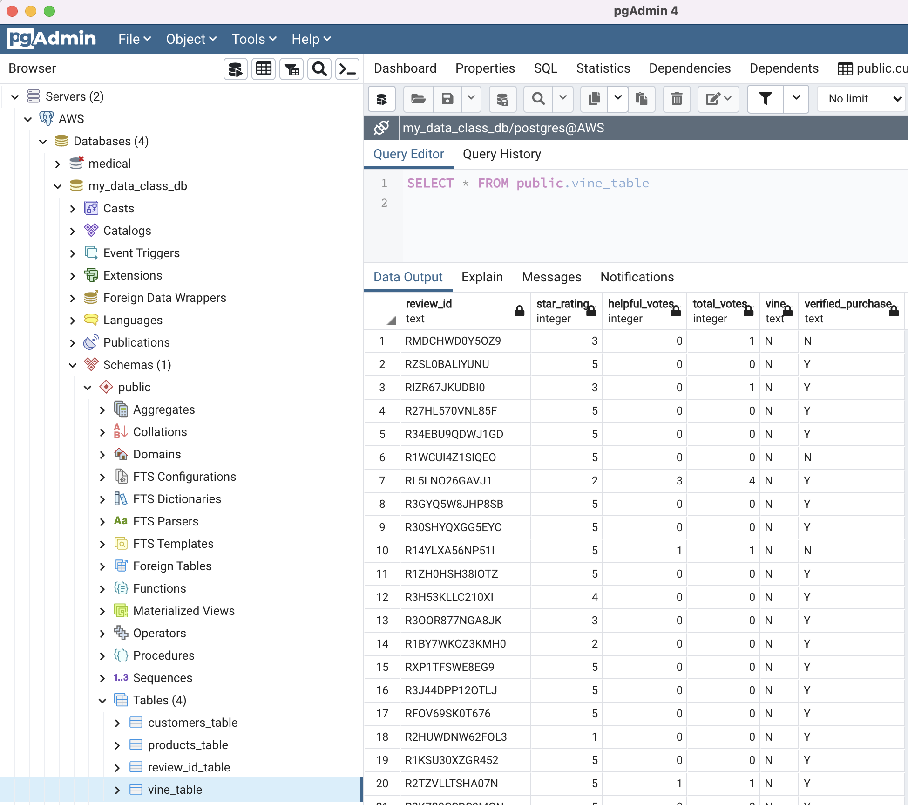

## Deliverable 2: Determine Bias of Vine Reviews

There is a DataFrame or table for the vine_table data using Pyspark.

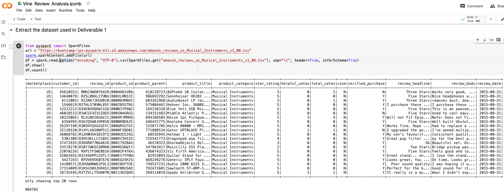

The data is filtered to create a DataFrame or table where there are 20 or more total votes.

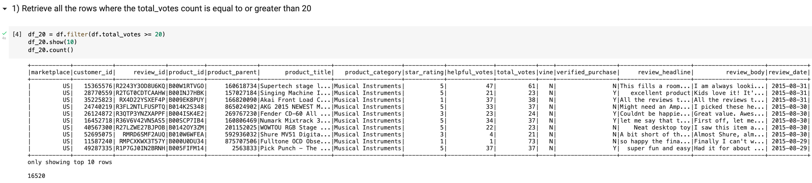

The data is filtered to create a DataFrame or table where the percentage of helpful_votes is equal to or greater than 50%.

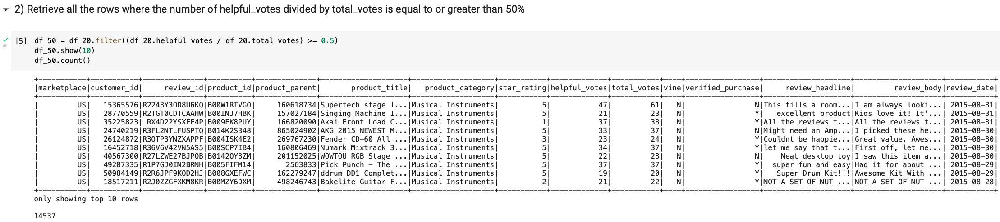

The data is filtered to create a DataFrame or table where there is a Vine review (paid).

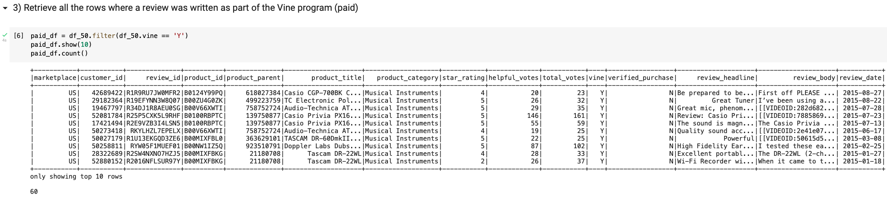

The data is filtered to create a DataFrame or table where there isn’t a Vine review (unpaid).

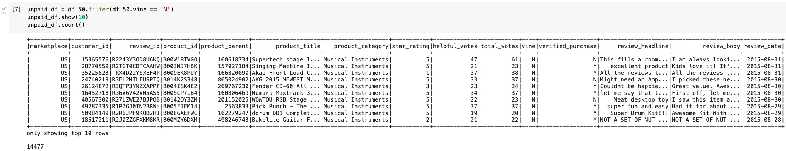

The total number of reviews, the number of 5-star reviews, and the percentage 5-star reviews are calculated for all Vine and non-Vine reviews.

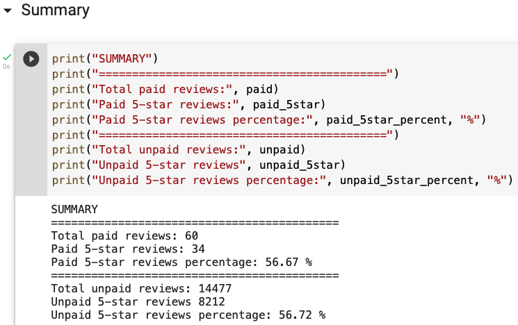

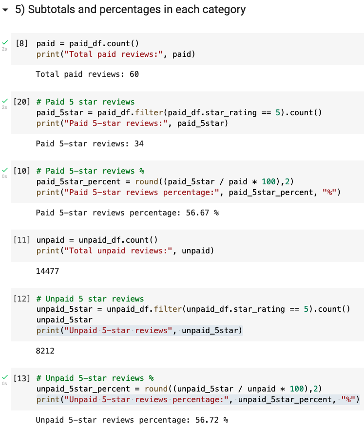

## Deliverable 3

### Analysis Overview

The objective of this analysis is to determine if there is any bias toward favorable reviews from Vine members in the Musical Instruments dataset selected from Amazon reviews.

PySpark was used to extract, transform, and load the transformed data in Google's Colaboratory site: "Colab".    

### Results

From the total 904,765 records, only 16,520 have more than 20 votes. From those, 14,537 pass the criterion of helpful/total higher than 50%.

* 60 reviews are paid versus 14,477 unpaid. The paid reviews represent just 0.4% of the unpaid figure.
* From the 60 paid reviews, 34 rated with a score of 5. This is 56.67%.
* On the 14,477 unpaid reviews, 8,212 gave a score of 5, representing 56.72% of the total.

### Summary

The paid reviews are negligible when compared to the total reviews (0.4%).

Both paid and unpaid reviews maintain the same ratio of 56% in their respective groups. Based on this alone, **it does not seem** to be any bias on the reviews.

If we consider that the reviews can take 5 values: 1, 2, 3, 4 or 5; we would have expected not to have half of the reviews only in the 5-star group. This is something that can be studied further.

Also, the initial cutoff values of 20 votes or more, and the 50% ratio can be changed, to see if there is any significant change on the results.