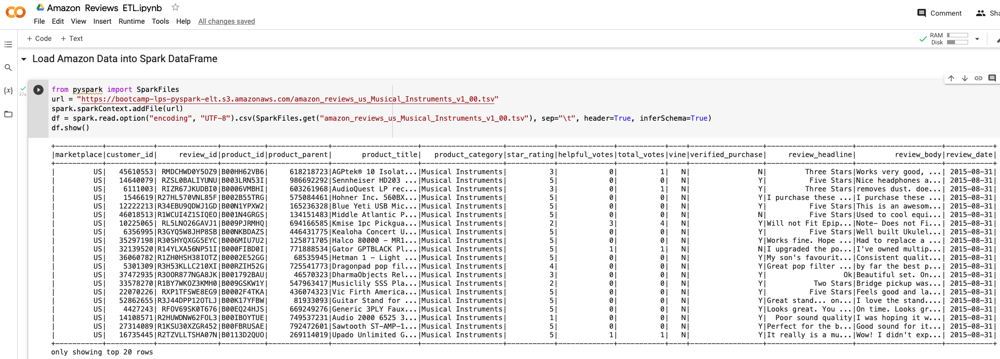
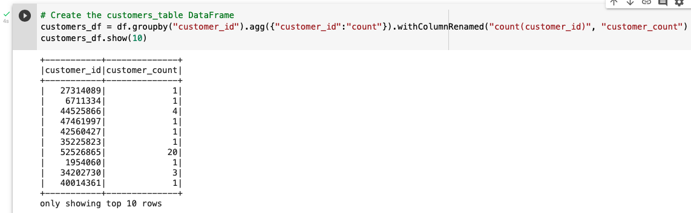
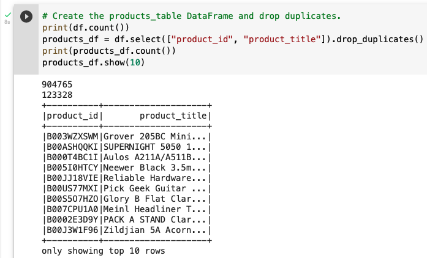

# Amazon_Vine_Analysis, Module 16 Challenge

## Deliverable 1: Perform ETL on Amazon Product Reviews 

The Amazon_Reviews_ETL.ipynb file does the following:
An Amazon Review dataset is extracted as a DataFrame (10 pt)

The extracted dataset is transformed into four DataFrames with the correct columns (20 pt)

All four DataFrames are loaded into their respective tables in pgAdmin (10 pt)

## Deliverable 2: Determine Bias of Vine Reviews

You will earn a perfect score for Deliverable 2 by completing all requirements below:
The analysis does the following:
There is a DataFrame or table for the vine_table data using one of three methods above (5 pt)
The data is filtered to create a DataFrame or table where there are 20 or more total votes (5 pt)
The data is filtered to create a DataFrame or table where the percentage of helpful_votes is equal to or greater than 50% (5 pt)
The data is filtered to create a DataFrame or table where there is a Vine review (5 pt)
The data is filtered to create a DataFrame or table where there isn’t a Vine review (5 pt)
The total number of reviews, the number of 5-star reviews, and the percentage 5-star reviews are calculated for all Vine and non-Vine reviews (15 pt)

## Deliverable 3: A Written Report on the Analysis

Structure, Organization, and Formatting (6 points)

The written analysis has the following structure, organization, and formatting:
There is a title, and there are multiple sections (2 pt)
Each section has a heading and subheading (2 pt)
Links to images are working, and code is formatted and displayed correctly (2 pt).
Analysis (14 points)

The written analysis has the following:
Overview of the analysis of the Vine program:
The purpose of this analysis is well defined (3 pt)
Results:
There is a bulleted list that addresses the three questions for unpaid and paid program reviews (7 pt)
Summary:
The summary states whether or not there is bias, and the results support this statement (2 pt)
An additional analysis is recommended to support the statement (2 pt)